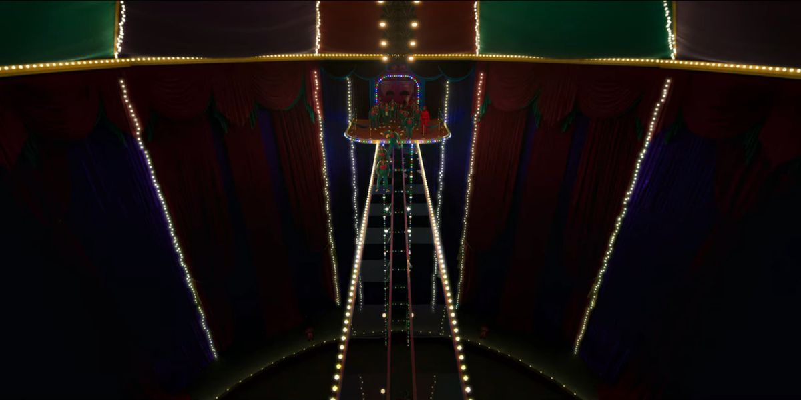
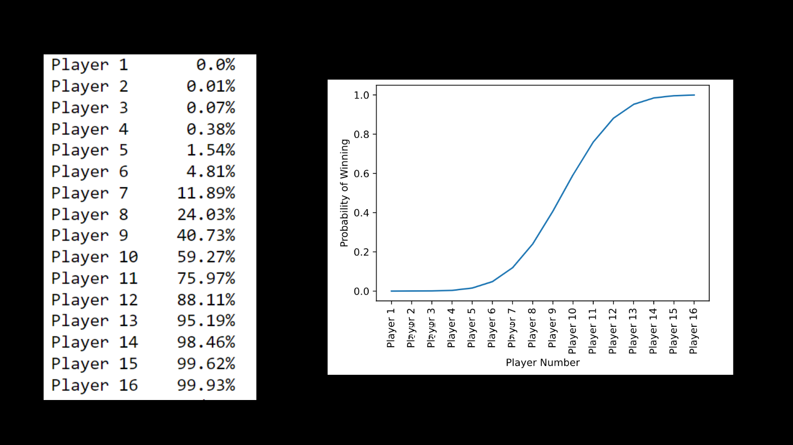

# Squid Game (Glass Bridge)

## Introduction

So in Squid game, there is this one game where there is a bridge made out of 18 pairs of glass tiles, and for each pair of glass tiles that are side by side, one of them can hold the weight of 2 persons and the other one will just break when someone step on it.

So we know that the last player will gain the most knowledge on where to step, but how much more likely is it for the last player to survive compare to other player and is it worth it to be the last player knowing we have time limit?

## Results

The table on the left shows probability of getting to the other end for each player. Probability for player 1 shows as 0% because it is so small that it gets rounded to 0. The plot on the right shows exactly the same thing with y axis being the probability of surviving and x axis being the player number.

As we can see, player that start very early has almost no chance of reaching the end and the probability rise the higher the player number is. But at some point, it has diminishing return meaning the difference in chance of survival between 1 player and the next is getting smaller and smaller at the very end. The chance of survival for Player 15 and 16 has only 0.3% difference. So knowing that there is time limit, it might not be worth it to be the very last players just to add a little bit of chance and risking dying from time limit.

It is very hard to estimate when the time will end as each player can be hesitant and not choosing quickly.
But if I am playing there, and I know that this game is about to be played beforehand, I would choose to be either player 12,13, or 14 as they seem to have a good balance of high chance of reaching the end and having enough time to actually do it.

## Details

## Assumptions

Since the real world is a bit messy, let's simplify the problem a little bit. In order to do that, we have to make some assumptions.

Assumptions:
1. Once a step is discovered everyone will know and never forget. So there is no scenario when someone is hesitant to step because they forget which glass tile is the correct one and then die.
2. Every player will go according to their number so player 1 go first then player 2, and so on
3. No one can tell which glass is the correct one, so there is no old dude that can distinguish glass based on refraction or sound

## Math behind it

$$P(p_i,x)=\sum_{j=0}^{x-1}(\frac{1}{2})^{x-j}*P(p_i-1,j)$$
Where:

    $P(p_i,x)$ = Probability of player number i to end in step number x(step number 1 start in the first pairs of glass tiles)

    x = The step player i will end on
Note:
x-1 because if player i-1 get into step x, then player i will at least get into step x+1 

Description of Formula:

Probability of player number i to end in step number x is equal to the sum of probability of player number i-1 end in step j multiplied by the probability of player number i choose x-j-1 correct steps and followed by 1 incorrect step.

Except some edge cases:

If x is the last step, then because the last step is not to a glass, player i will take 1 less guess. if player i-1 reach last step, player i can also reach the same step since there is no further step. For this case the formula changes into

$$P(p_i,x)=\sum_{j=0}^{x}(\frac{1}{2})^{max((x-j-1),0)}*P(p_i-1,j)$$

So the final formula can be written as:

$$P(p_i,x)=\sum_{j=0}^{x-1+isLastStep}(\frac{1}{2})^{max((x-j-isLastStep),0)}*P(p_i-1,j)$$

Note:
max((x-j-is_last_step),0) because if j == x and x is the last step then x-j-is_last_step = -1, and a player can not make -1 number of guess.